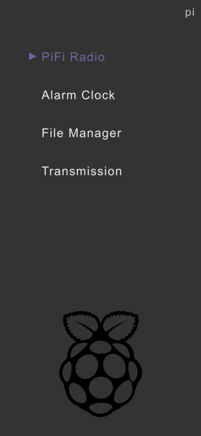

# Pi80

Home-page for the Raspberry Pi.



## Installation

- Clone this repo and create your `links.json` from the sample:
```
$ git clone https://github.com/rc2dev/pi80.git
$ cd pi80/public
$ cp links.json.sample links.json
```
- Edit `public/links.json` with the desired links and the hostname of your Pi.
- Point your webserver _(Apache, Nginx, Lighttpd, etc.)_ root to the `public` directory.

## Credits

<a href="https://iconscout.com/icon/raspberry-pi-4" target="_blank">Raspberry Pi icon</a> by [Icons8](https://iconscout.com/contributors/icons8)

## License

Released under [GPLv3](LICENSE)

Copyright (C) 2020-2022 [Rafael Cavalcanti](https://rafaelc.org/dev)
