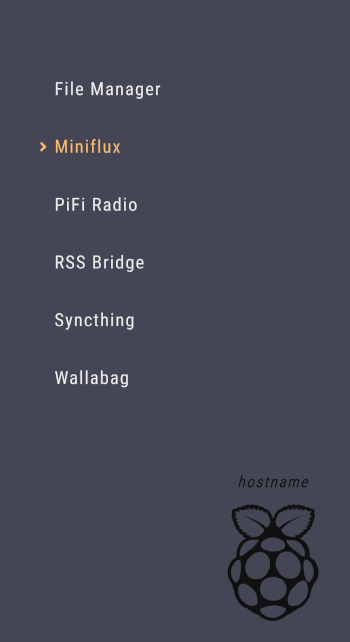

# Pi80

Home-page for the Raspberry Pi.

## Installation

- You'll need a webserver, such as Apache, Nginx, Lighttpd, etc.
- Clone this repo to your webserver directory (such as `/var/www/html`).
- Create your `links.json` by copying the sample: `cp links.json.sample links.json`.
- Edit `links.json` with the desired links and the hostname of your Pi.

## Credits

<a href="https://iconscout.com/icon/raspberry-pi-4" target="_blank">Raspberry Pi icon</a> by [Icons8](https://iconscout.com/contributors/icons8)

## License

Released under [GPLv3](LICENSE)

Copyright (C) 2020 Rafael Cavalcanti
